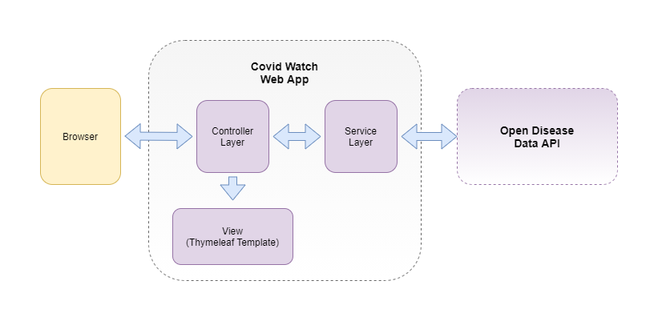
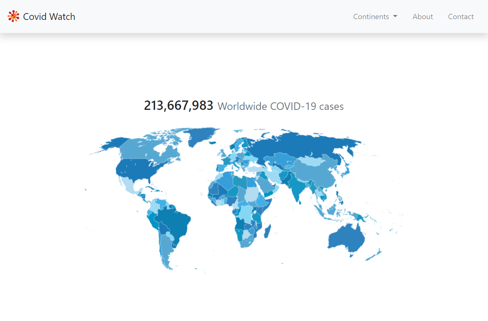
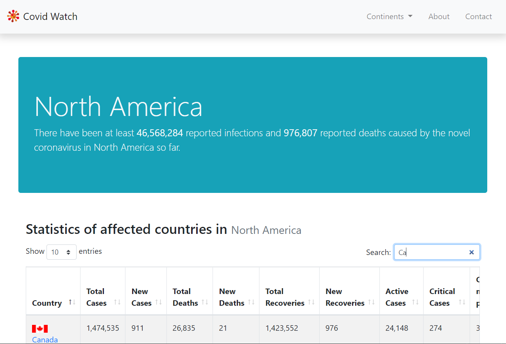
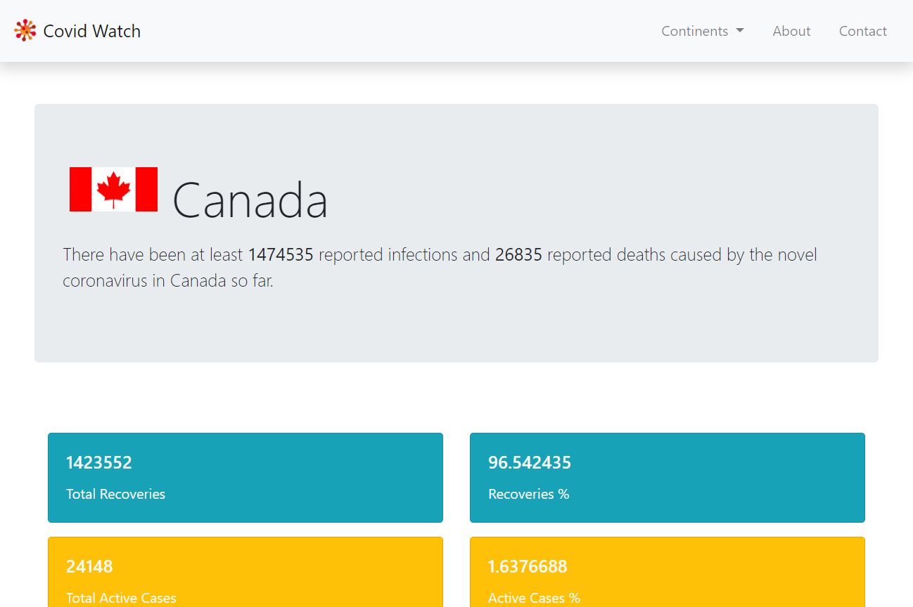
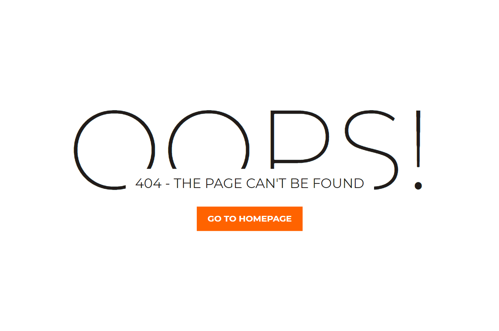
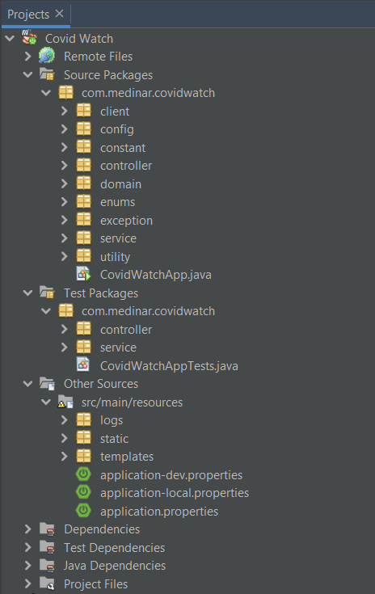
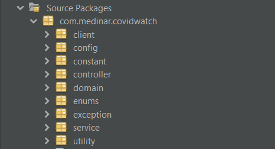
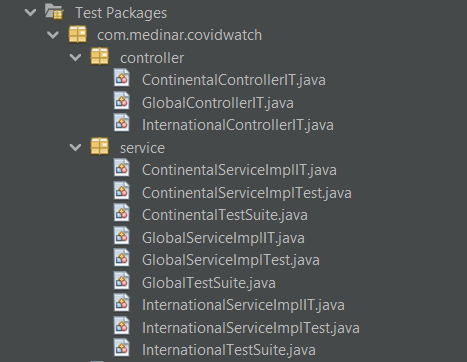
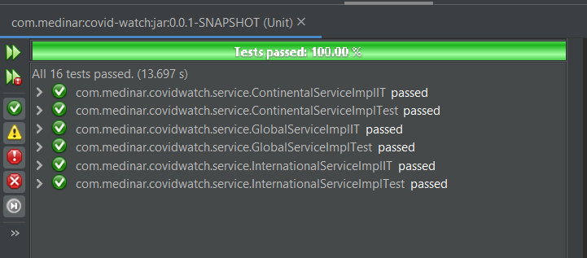

## Covid Watch v0.0.1
### Overview

A Java web application for getting the users updated on the current rate of COVID-19 cases and the number of active cases reported worldwide.  

The application uses data from a  Third Party API ([Open Disease Data API](https://disease.sh/)) for reliable global disease information.

### Covid Watch Web App Architecture Overview

The application uses the standard MVC architecture. The controller layer consisting of the Spring Controllers receives the client's requests. It then passes the requests to the Service Layer for processing. The Service layer will then give the results to the Controller, which sends it to a templating engine called Thymeleaf Template before being rendered on the screen. 



### Features

- The app utilizes Open Disease Data API for Covid-19 data which is updated every 10 minutes
- A Home page that displays details regarding worldwide Covid-19 cases
- A list of Continents that links to a specific Continent page
- A Continent Page that displays details regarding Covid-19 infections for that particular continent
- The Continent Page also displays a table of countries with its corresponding details
- A Country Page that displays details such as total cases, new cases, active cases, etc


### Screens

#### Home



------

#### Continent Page




------

#### Country Page




------

#### Error Page



------

### Exception Handling

Exceptions are being handled inside GlobalExceptionHandler class which uses the Spring's @ControllerAdvice annotation to capture exceptions in the application and to be taken accordingly.

### Project Structure



### Source Packages

The packages below contains the application logic for Covid Watch Web Application.



- **client** - contains classes for consuming the Open Diseases API
- **config** - contains the Java Configuration files
- **constant** - contains Constants class
- **controller** - contains the Controller classes
- **domain** - contains the domain objects or POJOs
- **enums** - contains Java enumeration classes
- **exception** contains custom java exceptions
- **service** - contains the Service classes
- **utility** - contains utility class

### Test Packages

The Test Package contains all tests that are used in this project such as the Unit tests, Integration Tests.




## Getting Started

These instructions will get you a copy of the project up and running on your local machine for development and testing purposes. 

### Prerequisites

What things you need to install the software and how to install them

```
GitHub Account
Java 11
IDE (Developed using Netbeans 12.1) or STS for Eclipse or IntelliJ
```

## Installing

1. Checkout code from GitHub repository:

   ```
   https://github.com/medinar/covid-watch.git
   ```

2. Open project in your IDE of choice as a maven project.

3. Clean and Build the project so that all required dependencies will be downloaded.

4. Run the project.

5. Open a browser.

6. Copy and paste to the address bar and press enter:
   ```
   localhost:9001/covid-watch/global
   ```


## Running the tests

1. On the Project Explorer, select the test files.

2. Right click on the test files then click Test File (Ctrl + F6).

3. Check the results.

   


## Built With

- [Java](https://www.java.com/en/) - a programming language used to develop enterprise applications
- [Spring](https://spring.io/) - a framework which provides a comprehensive programming and configuration model for modern Java-based enterprise applications
- [Spring Boot](https://spring.io/projects/spring-boot) - a tool for developing Spring based Java web applications and APIs faster and easier
- [Thymeleaf](https://www.thymeleaf.org) - an XML/XHTML/HTML5 template engine that is able to apply a set of transformations to template files in order to display data and/or text produced by web applications
- [Bootstrap](https://getbootstrap.com/) - a CSS Framework for developing responsive and mobile-first websites.
- [DataTables](https://datatables.net/) -  is a powerful Javascript library for adding interaction features to HTML tables
- [JUnit](https://junit.org/) -  a unit testing framework for Java programming language
- [Mockito](https://site.mockito.org/) - is a mocking framework, JAVA-based library that is used for effective unit testing of JAVA applications

## Author

- **Rommel D. Medina** - [Profile: medinar](https://github.com/medinar)