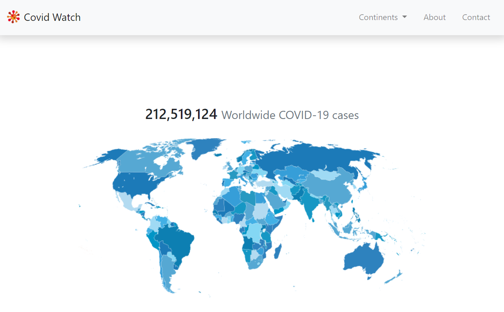
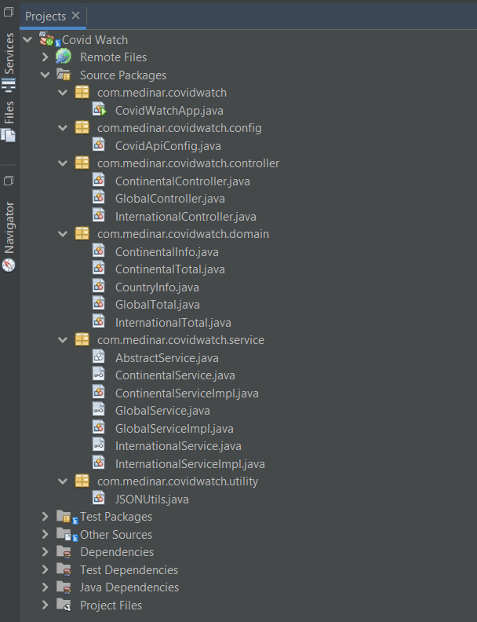

## Covid Watch
### Overview

A Java web application for getting the users updated on the current rate of COVID-19 cases and the number of active cases reported worldwide.  

The application uses data that comes from a  public API named Open Disease Data API - https://disease.sh/.





### Covid Watch Web App Architecture Overview

The application uses the standard MVC architecture. The controller layer consisting of the Spring Controllers receives the client's requests. It then passes the requests to the Service Layer for processing. The Service layer will then give the results to the Controller, which sends it to a templating engine called Thymeleaf Template before being rendered on the screen. 


### Features

- Displays the COVID-19 cases worldwide, the number of deaths and the number of recoveries
- Display the active cases and closed cases (Main Page)
  - Links for Continents (a map where the continents are clickable)
- Page per Continent
- Displays all countries and its total cases (Country is clickable)
  - Page per Country
- A table which displays the Cases Worldwide and per continent
  - Search by Country
  - Sorting

### Project Structure




### Packages

- **config** - contains the Java Configuration files
- **controller** - contains the Controller classes
- **domain** - contains the domain objects or POJOs
- **service** - contains the Service classes
- **utility** - contains utility class

### Domains

1. Global
2. Continental
3. International

## Getting Started

These instructions will get you a copy of the project up and running on your local machine for development and testing purposes. See deployment for notes on how to deploy the project on a live system.

### Prerequisites

What things you need to install the software and how to install them

```
GitHub Account
Java 11
IDE (Developed using Netbeans 12.1)
```

## Installing

1. Checkout code from GitHub repository:

   ```
   https://github.com/medinar/covid-watch.git
   ```

2. Open project in your IDE of choice as a maven project.

3. Clean and Build the project so that all required dependencies will be downloaded.

4. Run the project.

## Running the tests

1. Right click on the project then click Run Tests.
2. Check the results.

If all tests Passed then you're ready to start contributing to this application.

## Built With

- [Java](https://www.java.com/en/)
- [Spring](https://spring.io/)
- [Spring Boot](https://spring.io/projects/spring-boot)
- [Thymeleaf](https://www.thymeleaf.org)
- [Bootstrap](https://getbootstrap.com/)

## Author

- **Rommel D. Medina** - [Profile: medinar](https://github.com/medinar)

## License

## Acknowledgments
